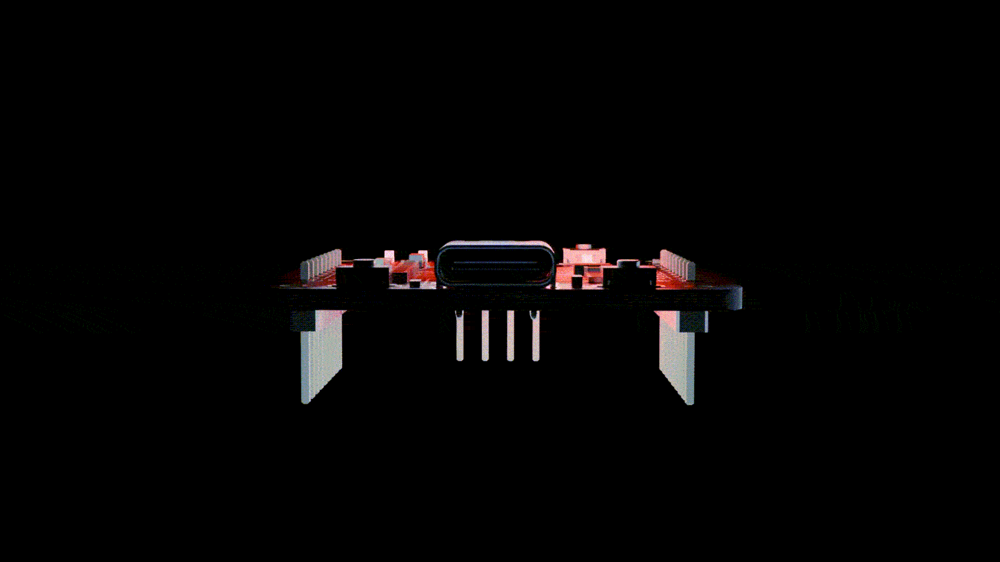
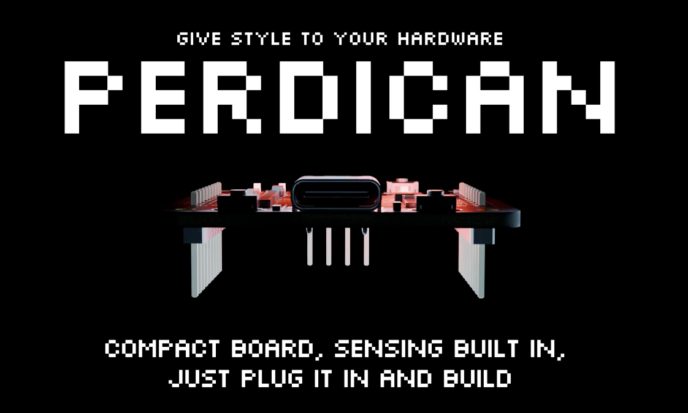

<h1 align="center">
   
  
   
  PERDICAN V1
   
</h1>

<h4 align="center">
A STM32 based devboard with an integrated IMU and 14 GPIO pins.
</h4>

  <a href="#about-the-project">About</a> •
  <a href="#repository-structure">Structure</a> •
  <a href="#schematic-on-kicad">Schematic</a> •
  <a href="#pcb-on-kicad">PCB</a> •
  <a href="#bill-of-materials">BOM</a> •
  <a href="#license">License</a> •
  <a href="#contributing">Contributing</a> •
  <a href="#credits">Credits</a>

 
 

## About the Project

**PERDICAN** is a STM32 based devboard designed with an integrated IMU, GPIO pins, buttons and LEDs

### Features

- **STM32G431CBT6** MCU 32-Bit 170MHz 128KB (128K x 8) FLASH 48-LQFP (7x7)
- **LSM6DS3TR-C** 6 axis IMU with Accelerometer, Gyroscope, Temperature
- **14 GPIO pins** to help make any hardware project
- **4 debugging pins** with SWCLK, SWDIO, GND and 3V3
- **Status LEDs** to see any error from 5V or 3V3
- **GPIO linked LED** to program it without needing an external LED
- **GPIO linked button** to use it without needing an external button
- **BOOT and RESET buttons**
- **USB-C input**
- **pixelated silkscreen art** to improve the overall look
- **Small size** of 3.7*3.9 cm

## Repository Structure

- `src/kicad/` - KiCad project sources
- `src/kicad/cad/` - full 3d model
- `production/` - PCB fabrication files (Gerbers, BOM, Pick & Place)
- `images/` - images used in the README and documentation

## Schematic on KiCad

Source : `src/kicad/schem/`  

## PCB on KiCad

Source : `src/KiCad/pcb/`  

  <table>
    <tr>
      <td valign="bottom"></td>
      <td valign="bottom"></td>
      <td valign="bottom"></td>
  </table>

  <table>
    <tr>
      <td valign="bottom"></td>
      <td valign="bottom">
</td>
  </table>

  

> The PCB design is made on only 2 layers, to reduce the cost of the board !
 

## Bill of Materials

Source: `production/pcb/bom.csv`

|Designator                       |Footprint                       |Quantity|Value           |LCSC Part #|
|---------------------------------|--------------------------------|--------|----------------|-----------|
|3V3, 5V, PA3                     |0603                            |3       |LED             |C2286      |
|BOOT                             |SW-SMD_L3.9-W3.0-P4.45          |1       |BOOT            |C455280    |
|C1, C11, C2, C7, C8              |0603                            |5       |1uF             |C15849     |
|C10, C13, C14, C3, C4, C5, C6, C9|0603                            |8       |100nF           |C14663     |
|C12                              |0603                            |1       |10nF            |C57112     |
|DEBUG                            |PinHeader_1x04_P2.54mm_Vertical |1       |Conn_01x04      |C2691448   |
|IMU1                             |LGA-14_L3.0-W2.5-P0.50-TL       |1       |LSM6DS3TR-C     |C967633    |
|J1                               |PinHeader_1x09_P2.54mm_Vertical |1       |Header Left     |C18213723  |
|J2                               |PinHeader_1x09_P2.54mm_Vertical |1       |Header Right    |C18213723  |
|PA2                              |SW-SMD_L3.9-W3.0-P4.45          |1       |PA2             |C455280    |
|R1, R2                           |0603                            |2       |5.1k            |C23186     |
|R10, R11, R3, R8, R9             |0603                            |5       |10k             |C25804     |
|R4, R5                           |0603                            |2       |100k            |C25803     |
|R6, R7                           |0603                            |2       |4.7k            |C23162     |
|RESET                            |SW-SMD_L3.9-W3.0-P4.45          |1       |RESET           |C455280    |
|STM32                            |LQFP-48_L7.0-W7.0-P0.50-LS9.0-BL|1       |STM32G431CBT6   |C529355    |
|U1                               |SOT-23-3                        |1       |XC6206PxxxMR    |C5446      |
|USB-C1                           |USB-C-SMD_TYPE-C-16PIN-2MD-073  |1       |TYPE-C 16PIN 2MD|C2765186   |

## JLPCB order

### LCSC parts 

  <table>
    <tr>
      <td valign="bottom"></td>
      <td valign="bottom"></td>
  </table>

  

>The PCB is expensive due to small vias. This will be arranged with bigger vias for the V2. BTW, I am not ordering it, I will do so for the V2.
 

## You might also like

- [APX USB HUB](https://github.com/gabouin/APX-USB-HUB) - A PTC-secured USB HUB designed for [Macondo - Hack Club](https://macondo.hackclub.com)
- [HackPad](https://github.com/Gabouin/Hackpad) - A 6-keys macropad designed for [Blueprint - Hack Club](https://blueprint.hackclub.com)
- See more in my [github](https://github.com/gabouin)

## Contributing

Contributions, improvements, and remixes are welcome! Please read the [CONTRIBUTING.md](CONTRIBUTING.md) guide to get started.

## License

This project is licensed under the **MIT License** - see the [LICENSE](LICENSE) file for details.

## Credits

This project uses:

- **KiCad** - PCB design and schematic capture
- **JLCPCB** - PCB manufacturing
- **LCSC** - Parts order
- **Figma** - Silkscreen and banner design
- **Blender** - CAD render
- **[@NotARoomba](https://github.com/notaroomba)** - Readme template
